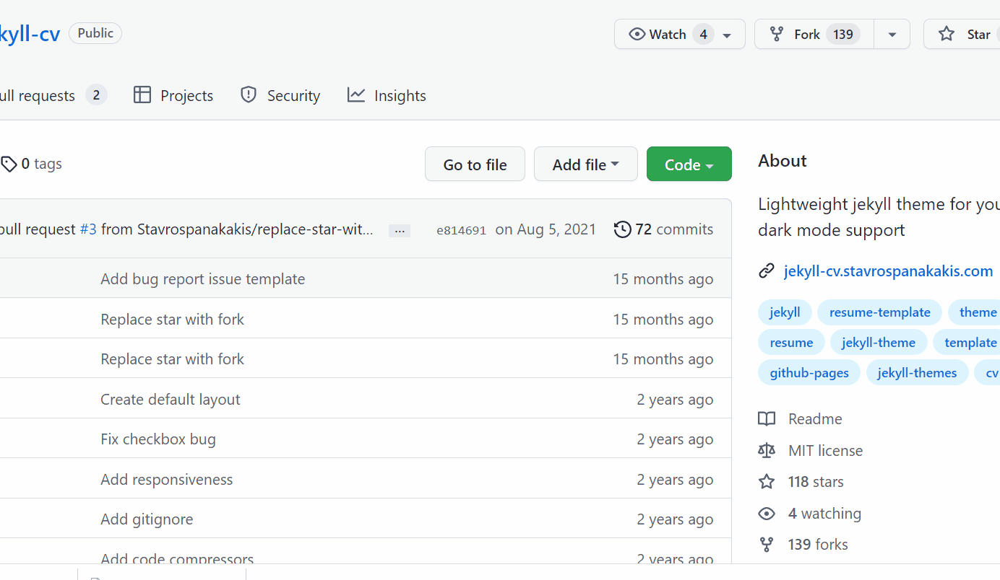
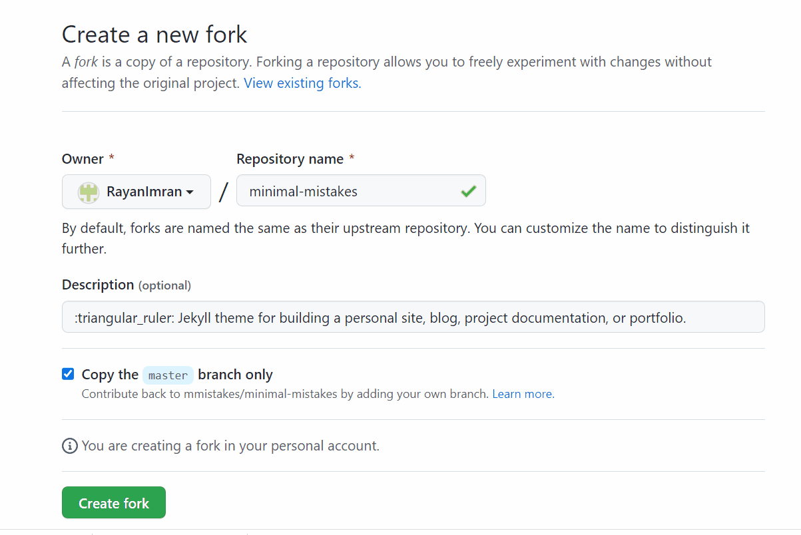
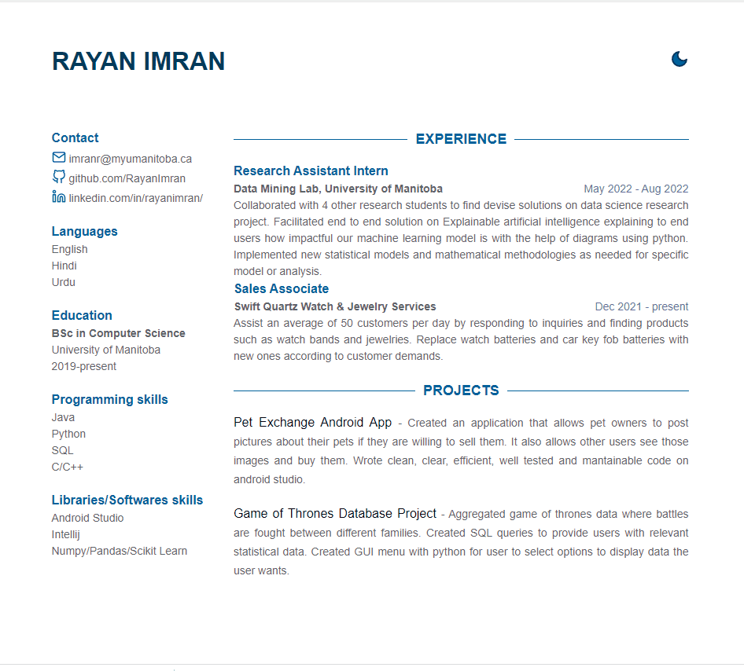

# Hosting a formatted Resume using github pages

## Features
This document provides practical instructions for hosting and formatting your resume using various technologies. Editing using the Markdown language, Markdown editor, Github Pages, and Jekyll (static site builder). In addition, this document also includes the general principles of modern technical writing described in Andrew Etter's book Modern Technical Writing, which are relevant to the practical steps ahead.

## Prerequisites
We will need to learn Markdown.We can use [Markdown Pad](http://www.markdownpad.com/) as suggested by Andrew Etter. We need a resume formatted in Markdown language. And A tutorial on how to use markdown is attached here [**More Resources**](https://github.com/RayanImran/rayanimran99.github.io/edit/main/README.md).

## Instructions
* **First step is to create a resume:**
First, you need a resume formatted in a lightweight markup called a markdown language. According to Andrew Etter, The whole point of lightweight markup is that to make it easy to create well-formed XML.There are already bult in Jekyll themes we can you that are lightweight markup. Before that we would need a github account.

* **Set up GitHub account:**
We use Github, the most widely used version control on the market. According to Etter , DVCS (Distributed Version Control) has good performance, can work offline, and is great for working on the same file at the same time. My resume and most other documents need to be updated regularly, so using a DVC is a great way to track my progress. Since we require constant changes in the long run Github is a great software that helps. Go to [**Github**](https://github.com/) and register your email address.

Once the github account is set up we can use a Jekyll theme of our choice. I have chose this [**theme**](https://github.com/Stavrospanakakis/jekyll-cv). Once you find a good theme go to it’s github repository and fork it as shown below

* Make sure your repository names end with github.io. Which will allow you to host a static website using github pages as shown below

* Once your repository is forked. You can edit changes to the existing data with your information for your resume. For my template, I edited data.yml file found here [github](https://github.com/RayanImran/rayanimran99.github.io/blob/main/_data/data.yml)

* Once edited you all are set to submit your job applications that has a cool dark mode feature

## More Resources 
- **Markdown Tutorial:** [This](https://commonmark.org/help/tutorial/) tutorial introduces a single Markdown concept with an example and helps you practice along.
- **Modern Technical Writing:** [This](https://www.amazon.ca/Modern-Technical-Writing-Introduction-Documentation-ebook/dp/B01A2QL9SS) This book by Andrew Etter provides the essential knowledge to start creating and publishing great software documentation.
- **Jekyll theme:** [This](https://jekyllthemes.io/free) allows thousands of free themes for Jekyll created bythe open source community. Here you'll find only the very best ones,hand-picked for their design and development quality.

## Authors

- **Rayan Imran** : *Instruction to host a resume with jekyll theme* - [rayanimran99](https://github.com/RayanImran/rayanimran99.github.io)

## Acknowledgements
honourable mention that helped me peer reviewed my resume
- **Yengin Loay**
- **Meixuan Chen**
- **Aidan Garvey**

## FAQs

1. Why is Markdown better than a word
processor?   

According to Andrew Etter, Documents with any kind of validity period must be placed under version control, Using Markdown helps us understand storing document online using version control .

2. Why is my resume not showing up?  

Make sure your repository is in the format username.github.io. It may take a while for it to be published live. So user can refresh it after 10-20 minutes and it should work.
